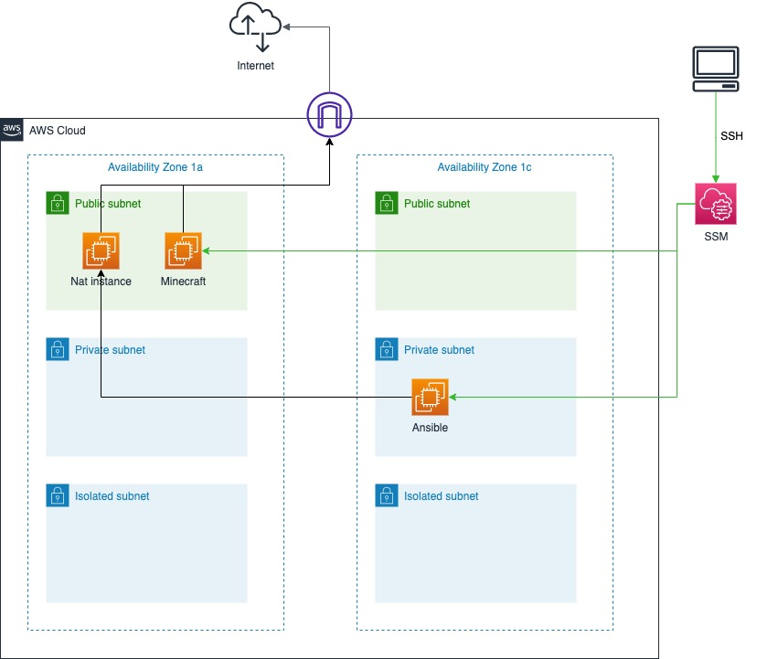

# Minecraft Server CDK

Minecraft ServerをAWS上に作成するCDKプロジェクトです。
以下のネットワーク・サーバ環境を構築します。

AWSのリージョンは`ap-notheast-1`を想定しています。

※2022/12/20時点でAnsibleサーバは一旦利用しないので作成されないようにしています



## 実行環境
CDKの実行環境は以下。

|環境| バージョン |
|--|--|
| aws cli | 2.3.7
| aws cdk | 2.10.0
| python | 3.9.12
| Pipenv | -

## 事前準備
CDK実行するに当たり、ソース内の以下のリソースについてはAWS上で事前作成したNameやIDを指定する必要があります。

|項目| 用途 | ソース箇所 |
|--|--|--|
| IAM Role | Ansibleサーバから各サーバへSSHするためのpemをパスパラメータから取得するためのポリシー設定| ./minecraft_server/resources/iam_role.py : 51行目付近|
| keyName | 各EC2に設定するキーペア名 |./cdk.json : 31行目付近|
## CDKの実行
以下コマンドでCDKを実行します。

初回実行時のbootstrap
```
pipenv --python 3
pipenv install
pipenv shell
cdk bootstrap
```

CDKの実行
```
pipenv shell　#初回実行から継続の場合は不要
cdk synth
cdk deploy --all
```

`Pipenv` を利用して`cdk`を実行するので、`cdk`コマンドを実行する前に`pipenv shell`コマンドでpython仮想環境をアクティベートします。

また、`cdk`のよく使うコマンドはPipfileにスクリプトとして定義済み（`./Pipfile`を参照）
`pipenv shell`コマンドを実行せずに、`pipenv run *`コマンドで実行可能です。

## よく使う cdk コマンド

 * `cdk ls`          list all stacks in the app
 * `cdk synth`       emits the synthesized CloudFormation template
 * `cdk deploy`      deploy this stack to your default AWS account/region
 * `cdk diff`        compare deployed stack with current state
 * `cdk docs`        open CDK documentation

